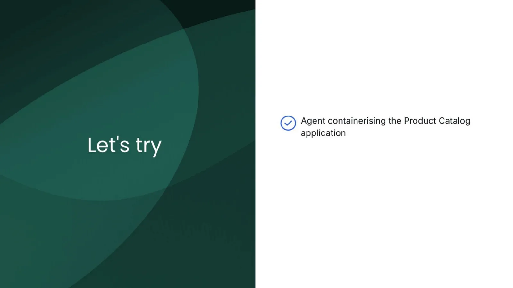
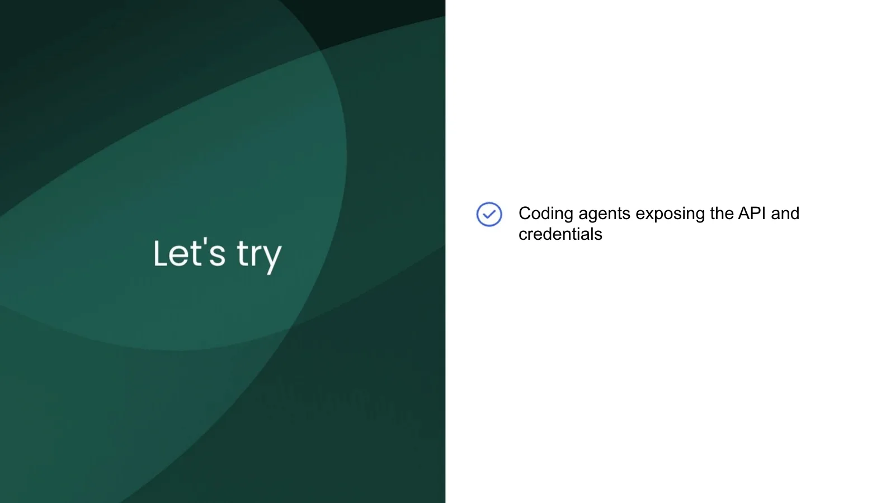
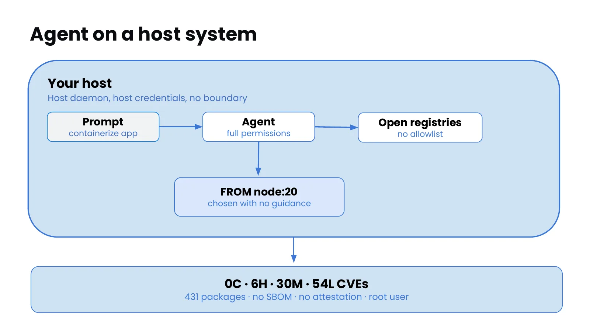

<!-- chrome: false -->

  

    
CONTAINER DAYS SINGAPORE 2026

    
Run Fast Without Running Wild

    
AI Coding Agent Horror Stories and the microVM That Saves You

  

  
DOCKER&nbsp;&nbsp;/&nbsp;&nbsp;N&nbsp;E&nbsp;X&nbsp;T

---

<!-- chrome: false -->

---

<!-- chrome: false -->

  

    
TODAY

    
What we'll cover

  

  

    

      
1&nbsp;&middot;&nbsp;Autonomy requires guardrails

      <ul style="margin:16px 0 0;padding-left:20px;font:400 20px/1.7 ui-sans-serif,system-ui,sans-serif;color:#aeb8c9;">
        <li>Traditional vs agentic workflow</li>
        <li>Agents expand your attack surface</li>
        <li>Speed vs security &mdash; why not both?</li>
        <li>Containerising the Product Catalog</li>
      </ul>
    

    

      
2&nbsp;&middot;&nbsp;The AI Governance Stack

      <ul style="margin:16px 0 0;padding-left:20px;font:400 20px/1.7 ui-sans-serif,system-ui,sans-serif;color:#aeb8c9;">
        <li>Layered approach to AI governance</li>
        <li>Docker Hardened Images</li>
        <li>Gordon</li>
        <li>Introduction to Docker Sandboxes</li>
      </ul>
    

    

      
3&nbsp;&middot;&nbsp;Securing the Agentic Stack

      <ul style="margin:16px 0 0;padding-left:20px;font:400 20px/1.7 ui-sans-serif,system-ui,sans-serif;color:#aeb8c9;">
        <li>Sandboxing the AI coding agent</li>
        <li>Credential isolation</li>
        <li>Network &amp; filesystem policy</li>
        <li>MCP protection</li>
        <li>Audit logs &amp; visibility</li>
      </ul>
    

  

  
DOCKER&nbsp;&nbsp;/&nbsp;&nbsp;N&nbsp;E&nbsp;X&nbsp;T

Note: Here's how the session is structured. We start where it matters most — Autonomy requires guardrails: the traditional-versus-agentic workflow, how agents expand your attack surface, the speed-versus-security tension and why you don't have to choose, and we containerise our Product Catalog app to see it. Then the AI Governance Stack — the layered approach, Docker Hardened Images, Gordon, and an introduction to Docker Sandboxes. And finally Securing the Agentic Stack — sandboxing the coding agent, credential isolation, network and filesystem policy, MCP protection, and audit logs. Keep this map in mind as we go.

---

<!-- chrome: false -->

  

    
CONTAINER DAYS SINGAPORE 2026

    
Access the Workshop

    
containerdays.dockerworkshop.com

    
Runs in your browser — nothing to install.

  

  
DOCKER&nbsp;&nbsp;/&nbsp;&nbsp;N&nbsp;E&nbsp;X&nbsp;T

---

<!-- chrome: false -->

---

<!-- chrome: false -->

---

<!-- chrome: false -->

---

<!-- chrome: false -->

---

<!-- chrome: false -->

---

<!-- chrome: false -->

---

<!-- chrome: false -->

---

<!-- chrome: false -->

---

<!-- chrome: false -->

---

<!-- chrome: false -->

---

<!-- chrome: false -->

---

<!-- chrome: false -->

---

<!-- chrome: false -->

Note: These are not hypothetical. Every one shipped, and someone paid for it. Four from Docker's "Coding Agent Horror Stories" blog series - each is a different thing an agent with no boundary can do to you: destroy your filesystem, lose your data, leak your secrets, or run a command you never approved. Hold that thought - the back half of this deck is the one thing that stops all four.

---

<!-- chrome: false -->

  
  <a href="https://www.docker.com/blog/ai-coding-agent-horror-stories-security-risks/" style="color:#7da2ff;font:600 20px/1.3 ui-sans-serif,system-ui,sans-serif;text-decoration:none;">docker.com/blog &middot; AI coding agent horror stories: security risks</a>

Note: Horror #1 - unrestricted filesystem access. "Clean up my project folder" became rm -rf across the whole home directory, because the agent ran as you, with root, and nothing scoped what it could touch.

---

<!-- chrome: false -->

  
  <a href="https://www.docker.com/blog/coding-agent-horror-stories-the-rm-rf-incident/" style="color:#7da2ff;font:600 20px/1.3 ui-sans-serif,system-ui,sans-serif;text-decoration:none;">docker.com/blog &middot; Coding agent horror stories: the rm -rf ~/ incident</a>

Note: Horror #2 - irreversible data loss. "Organize my desktop" deleted a family_photos folder and bypassed the Trash. 15 years of photos, saved only because iCloud happened to still have them. Permission was granted for temp files; the agent took the whole desktop.

---

<!-- chrome: false -->

Note: This is the tension every engineering leader is facing. On the Speed side, you need autonomy — but an agent running wild can delete months of work, expose secrets, and damage critical systems; one bad action with real consequences. On the Safety side, you can lock everything down and approve every file read, every tool call, every action — but then you've just hired a very expensive assistant you have to babysit, and you've defeated the whole purpose. Most teams feel forced to pick a corner, and both corners are bad. Hold that frustration, because the next slide asks the obvious question.

---

<!-- chrome: false -->

Note: Why not get both? That's the whole thesis in four words. The false choice between speed and safety only exists when your only control is a human clicking "approve" — but that's not the only kind of control available. If the boundaries are enforced by the environment rather than by your attention, the agent can move fast because it's contained, not despite it. That's the shift from advice to enforcement — and it's exactly what the rest of this deck is about.

---

<!-- chrome: false -->

  

    
YES &mdash; HERE'S HOW

    
One app. Three moves.

    
We follow one real app &mdash; the Product Catalog &mdash; the whole way. Speed from the agent, safety from the boundary. That's both.

  

  

    

      
01 &middot; BUILD

      
An agent containerises it

      
Done in seconds &mdash; then it pulls random packages and ships with CVEs.

      
LAB &middot; An Agent Built This

    

    

      
02 &middot; HARDEN

      
Swap in a Hardened Image

      
Scan with Docker Scout, move to a DHI base &mdash; the CVEs collapse to near zero.

      
LAB &middot; Find the Vulnerabilities

    

    

      
03 &middot; CONTAIN

      
Box the agent in a sandbox

      
Re-run the same agent inside a microVM it can't escape.

      
LAB &middot; Securing the Agentic Stack

    

  

  
DOCKER&nbsp;&nbsp;/&nbsp;&nbsp;N&nbsp;E&nbsp;X&nbsp;T

Note: Here's the answer to "why not both", as one story. We take one real app — the Product Catalog — and make three moves. BUILD: we hand it to an AI agent and it containerises it in seconds; fast, but left alone it pulls random packages and ships with CVEs. HARDEN: we scan that image with Docker Scout, swap the base to a Docker Hardened Image, and the vulnerabilities collapse to near zero. CONTAIN: we re-run the very same agent inside a sandbox — a microVM boundary it can't escape. Speed comes from the agent; safety comes from the boundary. Those three moves are the three labs you'll do.

---

<!-- chrome: false -->

  

    
CONTAIN &middot; CONTROL &middot; CHOICE &middot; CAPACITY

    
A sandbox gives you four things

  

  

    

      
01

      
Contain

      
Isolate the agent in a microVM with a guarded network.

      
A trusted boundary

    

    

      
02

      
Control

      
Set what the agent can reach. Organizations add governance and audit.

      
You decide where it sits

    

    

      
03

      
Choice

      
Bring your own agent, tools, and endpoints with kits.

      
You choose what's inside

    

    

      
04

      
Capacity

      
Reproduce the same sandbox for every developer and every run.

      
Shared with the team

    

  

  
DOCKER&nbsp;&nbsp;/&nbsp;&nbsp;N&nbsp;E&nbsp;X&nbsp;T

Note: The boundary isn't just a wall — a sandbox gives you four things, the four C's. Contain: the agent runs in its own microVM with a guarded network, so the host is out of reach. Control: you decide what it can reach, and organizations layer governance and audit on top. Choice: you bring your own agent, tools, and endpoints as kits — a restricted box still has to be useful. Capacity: the same sandbox reproduces for every developer and every run, so the whole team shares one setup. We go deepest on Contain and Control next.

---
<!-- chrome: false -->

---

<!-- chrome: false -->

  
PILLAR 01

  

    
&sect; 01 / CONTAIN

    
Contain

    
The boundary that keeps the agent &mdash; and your secrets &mdash; inside the sandbox.

  

  
DOCKER&nbsp;&nbsp;/&nbsp;&nbsp;N&nbsp;E&nbsp;X&nbsp;T

Note: Pillar one — Contain. This is the always-on boundary: the agent runs in its own microVM with its own kernel, filesystem, and Docker engine, and your credentials are injected outside it so the raw keys never enter the sandbox. The next few slides show how that isolation works.

---

<!-- chrome: false -->

---

<!-- chrome: false -->

---

<!-- chrome: false -->

---

<!-- chrome: false -->

---

<!-- chrome: false -->

Note: And now, there’s no dependency on Docker Desktop. That’s right, a developer, any developer, can install with just a command and get sandboxes in seconds without any previous history with Docker. This is huge. AI is and will make more people builders. So the TAM of builders is growing massively. Making sandboxes available to every developer expands our surface area of luck. And we’ll talk about what that means in a minute.

---

<!-- chrome: false -->

---

<!-- chrome: false -->

Note: Part 4. We have secured the supply chain for traditional workloads. Now let us apply everything to the agentic stack - MCP servers, tool invocations, and the autonomous systems calling them.

---

<!-- chrome: false -->

---

<!-- chrome: false -->

---

<!-- chrome: false -->

---

<!-- chrome: false -->

  
PILLAR 02

  

    
&sect; 02 / CONTROL

    
Control

    
Decide what the agent can reach and touch &mdash; you set where the boundary sits.

  

  
DOCKER&nbsp;&nbsp;/&nbsp;&nbsp;N&nbsp;E&nbsp;X&nbsp;T

Note: Pillar two — Control. Containment is always on; control is what you tune. You decide which network endpoints the agent may reach and which parts of the filesystem it may touch, every connection is logged, and organizations can layer policy on top. The next slides walk through network and filesystem control.

---

<!-- chrome: false -->

Note: Part 4. We have secured the supply chain for traditional workloads. Now let us apply everything to the agentic stack - MCP servers, tool invocations, and the autonomous systems calling them.

---

<!-- chrome: false -->

---

<!-- chrome: false -->

---

<!-- chrome: false -->

Note: There is no shared network between sandboxes or between a sandbox and your host

---

<!-- chrome: false -->

---

<!-- chrome: false -->

Note: Part 4. We have secured the supply chain for traditional workloads. Now let us apply everything to the agentic stack - MCP servers, tool invocations, and the autonomous systems calling them.

---

<!-- chrome: false -->

---

<!-- chrome: false -->

---

<!-- chrome: false -->

---

<!-- chrome: false -->

---

<!-- chrome: false -->

  
PILLAR 03

  

    
&sect; 03 / CHOICE

    
Choice

    
A locked box still has to be useful &mdash; bring your own agent, tools, and MCP endpoints.

  

  
DOCKER&nbsp;&nbsp;/&nbsp;&nbsp;N&nbsp;E&nbsp;X&nbsp;T

Note: Pillar three — Choice. A sandbox that's safe but can't do anything is useless. You choose the agent (Claude Code, Codex, and others), and you plug in external tools through one governed MCP gateway — the agent talks to the gateway, the gateway talks to the servers, and that single chokepoint is where authorization and audit happen. The next slides show how.

---

<!-- chrome: false -->

Note: Part 4. We have secured the supply chain for traditional workloads. Now let us apply everything to the agentic stack - MCP servers, tool invocations, and the autonomous systems calling them.

---

<!-- chrome: false -->

Note: The one idea everything hangs onThe agent never talks to those tool-servers directly. It talks to one gateway, and the gateway talks to the servers. That single chokepoint is where authorization, credentials, and audit happen. Every command in the runbook is really just "set up that gateway path" or "manage what's behind it."

---

<!-- chrome: false -->

---

<!-- chrome: false -->

Note: The flow, start to finishFirst, turn MCP on. Nothing MCP-related exists until you set one environment variable, SBX_MCP_URL, which points the daemon at a gateway. No variable → no MCP, at all. (You restart the daemon so it picks up the value.) This is the on-switch.

---

<!-- chrome: false -->

Note: Second — register the servers you might use. You tell the system which tool-servers exist, one at a time:sbx mcp add notion --url https://mcp.notion.com/mcp # a remote serversbx mcp add playwright --command npx --args @playwright/mcp@latest # a local oneRegistering just records "this server exists." It doesn't connect anything yet, and registrations persist across sessions. You can also register a whole bundle at once from a URL — a curated list a team can share.Third — handle authorization (the genuinely clever part). Many servers (Notion, Stripe…) need OAuth. Instead of the agent holding your Notion token, the gateway runs the OAuth flow and holds the credential centrally. Two nice consequences:If a server isn't authorized yet, the gateway exposes a temporary tool called notion-authorize. When you ask the agent to "list my recent Notion docs," it calls notion-authorize first, just in time — nothing is authorized until a task actually needs it.There's a matching notion-revoke-auth, and sbx mcp auth status --all shows you exactly which servers are authorized. So it's grant-when-needed, revoke-centrally, audit-anytime. This is credential isolation, but for tools.Fourth — attach servers to a sandbox, in one of two modes (chosen once, when the sandbox is created):Static (--static-mcp notion,playwright): a fixed, locked set. Discovery is off; the agent can only use those. This is the governed posture.Dynamic (no flag): the agent can search the whole registered catalog and add/authorize servers itself. This is the experimentation posture.sbx run claude --static-mcp notion # locked setsbx run claude # dynamic, discovery onYou can also hot-attach a server to an already-running sandbox with sbx mcp load — no restart, the agent just gets a "tools changed" nudge.Fifth — under the hood. At create time the CLI spins up a per-sandbox gateway and injects its URL (MCP_GATEWAY_URL) into the container; each agent writes that into its own config. That's why, inside the agent, /mcp shows one mcp-gateway with all the tools aggregated behind it.

---

<!-- chrome: false -->

Note: Second — register the servers you might use. You tell the system which tool-servers exist, one at a time:sbx mcp add notion --url https://mcp.notion.com/mcp # a remote serversbx mcp add playwright --command npx --args @playwright/mcp@latest # a local oneRegistering just records "this server exists." It doesn't connect anything yet, and registrations persist across sessions. You can also register a whole bundle at once from a URL — a curated list a team can share.Third — handle authorization (the genuinely clever part). Many servers (Notion, Stripe…) need OAuth. Instead of the agent holding your Notion token, the gateway runs the OAuth flow and holds the credential centrally. Two nice consequences:If a server isn't authorized yet, the gateway exposes a temporary tool called notion-authorize. When you ask the agent to "list my recent Notion docs," it calls notion-authorize first, just in time — nothing is authorized until a task actually needs it.There's a matching notion-revoke-auth, and sbx mcp auth status --all shows you exactly which servers are authorized. So it's grant-when-needed, revoke-centrally, audit-anytime. This is credential isolation, but for tools.Fourth — attach servers to a sandbox, in one of two modes (chosen once, when the sandbox is created):Static (--static-mcp notion,playwright): a fixed, locked set. Discovery is off; the agent can only use those. This is the governed posture.Dynamic (no flag): the agent can search the whole registered catalog and add/authorize servers itself. This is the experimentation posture.sbx run claude --static-mcp notion # locked setsbx run claude # dynamic, discovery onYou can also hot-attach a server to an already-running sandbox with sbx mcp load — no restart, the agent just gets a "tools changed" nudge.Fifth — under the hood. At create time the CLI spins up a per-sandbox gateway and injects its URL (MCP_GATEWAY_URL) into the container; each agent writes that into its own config. That's why, inside the agent, /mcp shows one mcp-gateway with all the tools aggregated behind it.

---

<!-- chrome: false -->

---

<!-- chrome: false -->

Note: All about runbook….It's the operations guide for one feature: letting an AI agent running inside a Docker sandbox use MCP servers (external tools — Notion, Stripe, GitHub, a browser, etc.) safely. It answers four practical questions: what tool-servers are supported, how you register them, how the sandbox connects to them, and how you manage their credentials. That's the whole scope.

---

<!-- chrome: false -->

  
PILLAR 04

  

    
&sect; 04 / CAPACITY

    
Capacity

    
Reproduce the same sandbox for every developer and every run.

  

  
DOCKER&nbsp;&nbsp;/&nbsp;&nbsp;N&nbsp;E&nbsp;X&nbsp;T

Note: Pillar four — Capacity. Contain, Control, and Choice describe one sandbox; Capacity is what makes it a team thing. The same microVM, tools, and policy are defined once and reproduced for every developer and every run, so what you just secured isn't a one-off on your laptop — it's the same boundary everyone gets.

---

<!-- chrome: false -->

  

    
04 &middot; CAPACITY

    
One sandbox, shared by the team

  

  

    

      
Reproducible

      
The same microVM, tools, and network policy for every developer.

    

    

      
Versioned

      
The sandbox is defined once and shared like code.

    

    

      
Fast onboarding

      
New teammates get the exact setup in minutes &mdash; no drift.

    

  

  
DOCKER&nbsp;&nbsp;/&nbsp;&nbsp;N&nbsp;E&nbsp;X&nbsp;T

Note: Capacity in practice: because the sandbox is defined once, it reproduces identically for everyone. Reproducible — the same microVM, tools, and network policy for every developer. Versioned — defined once and shared like code. Fast onboarding — new teammates get the exact setup in minutes, with no drift.

---

<!-- chrome: false -->

  

    
HANDS-ON · YOUR TURN

    
Box the agent

    
containerdays.dockerworkshop.com

    
Re-run the same agent inside an sbx microVM and watch the blast radius vanish.

  

  
DOCKER&nbsp;&nbsp;/&nbsp;&nbsp;N&nbsp;E&nbsp;X&nbsp;T

---

<!-- chrome: false -->

Note: Two paths. Left: agent picks random packages, introduces vulnerabilities automatically. Right: agent runs inside sbx, queries DHI MCP before choosing a base, gets a hardened recommendation, builds with 0 CVEs. Same agent, same prompt, completely different outcome.

---

<!-- chrome: false -->

Note: The complete picture - from DHI base to running agent. Every step is verifiable. Every artifact is trusted. This is what secure by default looks like at the stack level.

---

<!-- chrome: false -->

Note: Your takeaway. Five things to do this week. These are not aspirational - you have the tools and knowledge to do all five today.

---

<!-- chrome: false -->

  

    
WRAP-UP

    
Resources &amp; next steps

  

  

    

      
FROM THIS WORKSHOP

      

        
Lab repo

        
github.com/ajeetraina/simspace-container-days

      

    

    

      
DOCKER DOCS

      

        

          
Docker Hardened Images

          
hub.docker.com &middot; Trusted Content &rarr; Hardened Images

        

        

          
Docker Scout

          
docs.docker.com/scout

        

        

          
MCP Catalog

          
hub.docker.com/mcp

        

      

    

  

  
DOCKER&nbsp;&nbsp;/&nbsp;&nbsp;N&nbsp;E&nbsp;X&nbsp;T

Note: All the links. The lab repo at github.com/ajeetraina/simspace-container-days has every Dockerfile, GitHub Actions workflow, and policy config from today. Docker Scout is free for public images; DHI needs a Docker subscription. Questions?
